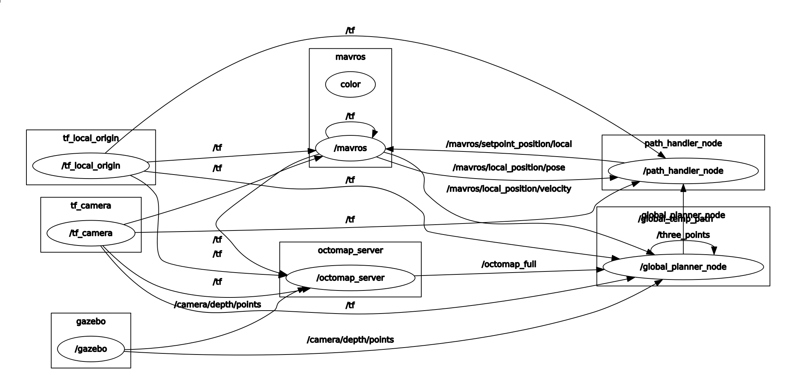

# Obstacle Detection and Avoidance
PX4 computer vision algorithms packaged as ROS nodes for depth sensor fusion and obstacle avoidance. This repository contains two different implementations:

  * *local_planner* is a local VFH+* based planner that plans (including some history) in a vector field histogram
  * *global_planner* is a global, graph based planner that plans in a traditional octomap occupancy grid

The two algorithms are standalone and they are not meant to be used together.

The *local_planner* requires less computational power but it doesn't compute optimal paths towards the goal since it doesn't store information about the already explored environment. On the other hand, the *global_planner* is computatonally more expensive since it builds a map of the environment. For the map to be good enough for navigation, accurate global position and heading are required. 

> **Note** The development team is right now focused on the *local_planner*.
  
The documentation contains information about how to setup and run the two planner systems on the Gazebo simulator and on a companion computer running Ubuntu 16.04, for both avoidance and collision prevention use cases.

> **Note** PX4-side setup is covered in the PX4 User Guide:
  - [Obstacle Avoidance](https://docs.px4.io/en/computer_vision/obstacle_avoidance.html)
  - [Collision Prevention](https://docs.px4.io/en/computer_vision/collision_prevention.html)

## Bi-weekly Dev Call
The active developers of the avoidance repo are syncing up on a bi-weekly basis on the WG dev call.

* Join the call: https://zoom.us/j/506512712
* Time: Monday, 5PM CET
* Meeting ID: 506512712
* Dronecode calendar: https://www.dronecode.org/calendar/

[](https://www.youtube.com/watch?v=VqZkAWSl_U0)

# Table of Contents
- [Getting Started](#getting-started)
  - [Installation](#installation)
    - [Quick Start with Docker](#quick-start-with-docker)
    - [Installation for Ubuntu 16.04 and ROS Kinetic](#installation-for-ubuntu-16.04-and-ros-kinetic)
  - [Run the Avoidance Gazebo Simulation](#run-the-avoidance-gazebosimulation)
    - [Local Planner](#local-planner)
    - [Global Planner](#global-planner)
  - [Run on Hardware](#run-on-hardware)
    - [Prerequisite](#prerequisite)
    - [Local Planner](#local-planner)
    - [Global Planner](#global-planner)
- [Troubleshooting](#troubleshooting)
- [Advanced](#advanced)
  - [Message Flows](#message-flow)
    - [PX4 and local planner](#px4-and-local-planner)
    - [PX4 and global planner](#px4-and-gloabl-planner)
- [Contributing](#contributing)

# Getting Started

## Installation

### Quick Start with Docker

A ROS container based on Ubuntu 16.04 has been created and can be used to quickly try the simulation, as a demo. Running it is as simple as installing docker and docker-compose, and running `$ docker-compose up` from the right folder. Find the corresponding instructions [here](docker/demo).

For __deployment__ instructions, check "[Deploying with Docker](docker#deploying-with-docker)".

If you want to leverage docker in your __development__ environment, check the "[Developing with Docker](docker#developing-with-docker)" section.

### Installation for Ubuntu 16.04 and ROS Kinetic

This is a step-by-step guide to install and build all the prerequisites for running this module on Ubuntu 16.04. You might want to skip some of them if your system is already partially installed. A corresponding docker container is defined [here](docker/ubuntu/Dockerfile) as reference.

Note that in the following instructions, we assume your catkin workspace (in which we will build the avoidance module) is in `~/catkin_ws`, and the PX4 Firmware directory is `~/Firmware`. Feel free to adapt this to your situation.

1. Add ROS to sources.list.

   ```bash
   echo "deb http://packages.ros.org/ros/ubuntu $(lsb_release -sc) main" > /etc/apt/sources.list.d/ros-latest.list
   sudo apt-key adv --keyserver hkp://ha.pool.sks-keyservers.net:80 --recv-key 421C365BD9FF1F717815A3895523BAEEB01FA116
   sudo apt update
   ```

1. Install gazebo with ROS.

   ```bash
   sudo apt install ros-kinetic-desktop-full
   
   # Source ROS
   source /opt/ros/kinetic/setup.bash
   ```

  Full installation of ROS Kinetic comes with Gazebo 7.
  
  If you are using different version of Gazebo, 
  
  please make sure install ros-gazebo related packages
  
  For Gazebo 8,
  ```
  sudo apt install ros-kinetic-gazebo8-*
  ```
  For Gazebo 9,
  ```
  sudo apt install ros-kinetic-gazebo9-*
  ```
  
1. Initialize rosdep.

   ```bash
   rosdep init
   rosdep update
   ```

1. Install catkin and create your catkin workspace directory.

   ```bash
   sudo apt install python-catkin-tools
   mkdir -p ~/catkin_ws/src
   ```

1. Install mavros version 0.29.0 or above. Instructions to install it from sources can be found here: https://dev.px4.io/en/ros/mavros_installation.html. If you want to install using apt, be sure to check that the version is 0.29.0 or greater.

   ```bash
   sudo apt install ros-kinetic-mavros ros-kinetic-mavros-extras
   ```

1. Install the geographiclib dataset

   ```bash
   wget https://raw.githubusercontent.com/mavlink/mavros/master/mavros/scripts/install_geographiclib_datasets.sh
   chmod +x install_geographiclib_datasets.sh
   sudo ./install_geographiclib_datasets.sh
   ```

1. Install avoidance module dependencies (pointcloud library and octomap).

   ```bash
   sudo apt install libpcl1 ros-kinetic-octomap-* ros-kinetic-yaml-*
   ```

1. Clone this repository in your catkin workspace in order to build the avoidance node.

   ```bash
   cd ~/catkin_ws/src
   git clone https://github.com/PX4/avoidance.git
   ```

1. Actually build the avoidance node.

   ```bash
   catkin build -w ~/catkin_ws
   ```
   
   Note that you can build the node in release mode this way:
   
   ```bash
   catkin build -w ~/catkin_ws --cmake-args -DCMAKE_BUILD_TYPE=Release
   ```

1. Source the catkin setup.bash from your catkin workspace.

   ```bash
   source ~/catkin_ws/devel/setup.bash
   ```

## Run the Avoidance Gazebo Simulation

In the following section we guide you trough installing and running a Gazebo simulation of both local and global planner. 

### Build and Run the Simulator

1. Clone the PX4 Firmware and all its submodules (it may take some time).

   ```bash
   cd ~
   git clone https://github.com/PX4/Firmware.git
   cd ~/Firmware
   git submodule update --init --recursive
   ```

1. Install PX4 dependencies. A complete list is available on the [PX4 Dev Guide](http://dev.px4.io/en/setup/dev_env_linux_ubuntu.html#common-dependencies).

1. We will now build the Firmware once in order to generate SDF model files for Gazebo. This step will actually run a simulation that you can directly quit.

   ```bash
   # Add the models from the avoidance module to GAZEBO_MODEL_PATH
   export GAZEBO_MODEL_PATH=${GAZEBO_MODEL_PATH}:~/catkin_ws/src/avoidance/sim/models
   
   # This is necessary to prevent some Qt-related errors (feel free to try to omit it)
   export QT_X11_NO_MITSHM=1
   
   # Setup some more Gazebo-related environment variables
   . ~/Firmware/Tools/setup_gazebo.bash ~/Firmware ~/Firmware/build/px4_sitl_default
   
   # Build and run simulation
   make px4_sitl_default gazebo
   ```

1. Add the Firmware directory to ROS_PACKAGE_PATH so that ROS can start PX4.

   ```bash
   export ROS_PACKAGE_PATH=${ROS_PACKAGE_PATH}:~/Firmware
   ```

You should now be ready to run the simulation using local or global planner.

### Global Planner

This section shows how to start the *global_planner* and use it for avoidance in offboard mode.

```bash
roslaunch global_planner global_planner_sitl_mavros.launch
```

You should now see the drone unarmed on the ground, and the octomap should show 2 red arrows and the visible world, as pictured below.


To start flying, put the drone in OFFBOARD mode and arm it. The avoidance node will then take control of it.

```bash
# In another terminal
rosrun mavros mavsys mode -c OFFBOARD
rosrun mavros mavsafety arm
```

Initially the drone should just hover at 3.5m altitude.

From the command line, you can also make Gazebo follow the drone, if you want.

```bash
gz camera --camera-name=gzclient_camera --follow=iris
```

During the simulation, the ROS node *"/path_handler_node"* continuously publishes positions to the topic *"/mavros/setpoint_position/local"*.

The graph of the ROS nodes is shown below:



One can plan a new path by setting a new goal with the *2D Nav Goal* button in rviz. The planned path should show up in rviz and the drone should follow the path, updating it when obstacles are detected. It is also possible to set a goal without using the obstacle avoidance (i.e. the drone will go straight to this goal and potentially collide with obstacles). To do so, set the position with the *2D Pose Estimate* button in rviz.


### Local Planner

This section shows how to start the *local_planner* and use it for avoidance in mission or offboard mode.

The planner is based on the [3DVFH+](http://ceur-ws.org/Vol-1319/morse14_paper_08.pdf) algorithm. To run the algorithm it is possible to

* simulate a forward looking stereo camera running OpenCV's block matching algorithm (SGBM by default)

   ```bash
   # if stereo-image-proc not yet installed
   sudo apt install ros-kinetic-stereo-image-proc
   
   roslaunch local_planner local_planner_stereo.launch
   ```

   The disparity map from `stereo-image-proc` is published as a [stereo_msgs/DisparityImage](http://docs.ros.org/api/stereo_msgs/html/msg/DisparityImage.html) message, which is not supported by rviz or rqt. To visualize the    message, either run:

   ```bash
   # if image_view is not yet installed
   sudo apt install ros-kinetic-image-view
   
   rosrun image_view stereo_view stereo:=/stereo image:=image_rect_color
   ```

   or publish the DisparityImage as a simple sensor_msgs/Image

   ```bash
   rosrun topic_tools transform /stereo/disparity /stereo/disparity_image sensor_msgs/Image 'm.image'
   ```

   Now the disparity map can be visualized by rviz or rqt under the topic */stereo/disparity_image*.

* simulate a forward looking kinect depth sensor:

   ```bash
   roslaunch local_planner local_planner_depth-camera.launch
   ```

* simulate a three kinect depth sensors:

   ```bash
   roslaunch local_planner local_planner_sitl_3cam.launch
   ```

You will see the Iris drone unarmed in the Gazebo world. To start flying, there are two options: OFFBOARD or MISSION mode. For OFFBOAD, run:

```bash
# In another terminal
rosrun mavros mavsys mode -c OFFBOARD
rosrun mavros mavsafety arm
```

The drone will first change its altitude to reach the goal height. It is possible to modify the goal altitude with `rqt_reconfigure` GUI.

Then the drone will start moving towards the goal. The default x, y goal position can be changed in Rviz by clicking on the 2D Nav Goal button and then choosing the new goal x and y position by clicking on the visualized gray space. If the goal has been set correctly, a yellow sphere will appear where you have clicked in the grey world.


For MISSIONS, open [QGroundControl](http://qgroundcontrol.com/) and plan a mission as described [here](https://docs.px4.io/en/flight_modes/mission.html). Set the parameter `MPC_OBS_AVOID` true. Start the mission and the vehicle will fly the mission waypoints dynamically recomputing the path such that it is collision free.

# Run on Hardware

## Prerequisite

### Camera

Both planners require a 3D point cloud of type `sensor_msgs::PointCloud2`. Any camera that can provide such data is compatible.

The officially supported camera is Intel Realsense D435. We recommend using Firmware version 5.9.13.0. The instructions on how to update the Firmware of the camera can be found [here](https://www.intel.com/content/www/us/en/support/articles/000028171/emerging-technologies/intel-realsense-technology.html)

> **Tip:** Be careful when attaching the camera with a USB3 cable. USB3 might might interfere with GPS and other signals. If possible, always use USB2 cables.

Other tested camera models are: Intel Realsense D415 and R200.

#### Generating Point-clouds from Depth-maps

In case the point-cloud stream already exists, this step can be skipped.

Assuming there already exists a stream of depth-maps on the ROS-topic <depthmap_topic>, we need to generate a corresponding stream of depth-maps.
Start by following the instructions from [PX4/disparity_to_point_cloud](https://github.com/PX4/disparity_to_point_cloud).
Now run the point-cloud generation with the parameters for the camera intrinsics:

```bash
rosrun disparity_to_point_cloud disparity_to_point_cloud_node \
    fx_:=fx fy_:=fy cx_:=cx cy_:=cy base_line_:=base_line disparity:=<depthmap_topic>
```

A stream of point-clouds should now be published to */point_cloud*.

### PX4 Autopilot

Parameters to set through QGC:
* `MPC_OBS_AVOID` to Enabled
* `MAV_1_CONFIG`, `MAV_1_MODE`, `SER_TEL2_BAUD` to enable MAVLink on a serial port. For more information: [PX4 Dev Guide](http://dev.px4.io/en/companion_computer/pixhawk_companion.html#pixhawk-setup)

### Companion Computer

* OS: Ubuntu 16.04 OS or a docker container running Ubuntu 16.04 must be setup (e.g. if using on a Yocto based system). 
* ROS Kinetic: see [Installation](#installaton)
* Other Required Components for Intel Realsense:
  - Librealsense (Realsense SDK). The installation instructions can be found [here](https://github.com/IntelRealSense/librealsense/blob/master/doc/installation.md)
  - [Librealsense ROS wrappers](https://github.com/intel-ros/realsense.git)

Tested models:
- local planner: Intel NUC, Jetson TX2, Intel Atom x7-Z8750 (built-in on Intel Aero RTF drone)
- global planner: Odroid

## Global Planner

The global planner has been so far tested on a Odroid companion computer by the development team.

## Local Planner

Once the catkin workspace has been built, to run the planner with a Realsense D435 camera launch *local_planner_example.launch* editing the arguments:

1. `tf_*` representing the displacement between the camera and the flight controller
2. `fcu_url` representing the port connecting the companion computer to the flight controller
3. `serial_no_camera_front` representing the Realsense serial number

For example:
```bash
roslaunch local_planner local_planner_example.launch tf_x:=0.20 tf_y:=0.0 tf_z:=-0.2
```

The planner is running correctly when

```bash
[OA] Planning started, using 1 cameras
```

is displayed on the console.

The local planner supports also multi camera setups. `local_planner_example.launch` needs to be modified by:

1. launching one RealSense nodlet (`rs_depthcloud.launch`) for each camera making sure that each of them has a unique `namespace`
2. launch one `static_transform_publisher` node for each camera

An example of a three camera launch file is [local_planner_A700_3cam.launch](https://github.com/PX4/avoidance/blob/master/local_planner/launch/local_planner_A700_3cam.launch).


# Troubleshooting

### I see the drone position in rviz (shown as a red arrow), but the world around is empty
Check that some camera topics (including */camera/depth/points*) are published with the following command:

```bash
rostopic list | grep camera
```

If */camera/depth/points* is the only one listed, it may be a sign that gazebo is not actually publishing data from the simulated depth camera. Verify this claim by running:

```bash
rostopic echo /camera/depth/points
```

When everything runs correctly, the previous command should show a lot of unreadable data in the terminal. If you don't receive any message, it probably means that gazebo is not publishing the camera data.

Check that the clock is being published by Gazebo:

```bash
rostopic echo /clock
```

If it is not, you have a problem with Gazebo (Did it finish loading the world? Do you see the buildings and the drone in the Gazebo UI?). However, if it is publishing the clock, then it might be a problem with the depth camera plugin. Make sure the package `ros-kinetic-gazebo-ros-pkgs` is installed. If not, install it and rebuild the Firmware (with `$ make px4_sitl_default gazebo` as explained above).

### I see the drone and world in rviz, but the drone does not move when I set a new "2D Nav Goal"
Is the drone in OFFBOARD mode? Is it armed and flying?

```bash
# Set the drone to OFFBOARD mode
rosrun mavros mavsys mode -c OFFBOARD
# Arm
rosrun mavros mavsafety arm
```

### I see the drone and world in rviz, but the drone does not follow the path properly
Some tuning may be required in the file *"<Firmware_dir>/posix-configs/SITL/init/rcS_gazebo_iris"*.

### I see the drone and world in rviz, I am in OFFBOARD mode, but the planner is still not working
Some parameters that can be tuned in *rqt reconfigure*.

# Advanced

## Message Flows

More information about the communication between avoidance system and the Autopilot can be found in the [PX4 User Guide](https://docs.px4.io/en/computer_vision/obstacle_avoidance.html)

### PX4 and local planner

This is the complete message flow *from* PX4 Firmware to the local planner.

PX4 topic | MAVLink | MAVROS Plugin | ROS Msgs. | ROS Topic 
--- | --- | --- | --- | ---
vehicle_local_position | LOCAL_POSITION_NED | local_position | geometry_msgs::PoseStamped | mavros/local_position/pose
vehicle_local_position | LOCAL_POSITION_NED | local_position | geometry_msgs::TwistStamped | mavros/local_position/velocity
vehicle_local_position | ALTITUDE | altitude | mavros_msgs::Altitude | mavros/altitude 
home_position | ALTITUDE | altitude | mavros_msgs::Altitude | mavros/altitude
vehicle_air_data | ALTITUDE | altitude | mavros_msgs::Altitude | mavros/altitude
vehicle_status | HEARTBEAT | sys_status | mavros_msgs::State | mavros/state
vehicle_trajectory_waypoint_desired | TRAJECTORY_REPRESENTATION_WAYPOINT | trajectory  | mavros_msgs::Trajectory | mavros/trajectory/desired

This is the complete message flow *to* PX4 Firmware from the local planner.

ROS topic | ROS Msgs. | MAVROS Plugin | MAVLink | PX4 Topic 
--- | --- | --- | --- | ---
/mavros/setpoint_position/local (offboard) | geometry_msgs::PoseStamped | setpoint_position | SET_POSITION_LOCAL_POSITION_NED | position_setpoint_triplet
/mavros/setpoint_velocity/cmd_vel_unstamped (offboard) | geometry_msgs::TwistStamped | setpoint_velocity | SET_POSITION_LOCAL_POSITION_NED | position_setpoint_triplet
/mavros/trajectory/generated (mission) | mavros_msgs::Trajectory | trajectory | TRAJECTORY_REPRESENTATION_WAYPOINT | vehicle_trajectory_waypoint
/mavros/obstacle/send | sensor_msgs::LaserScan | obstacle_distance | OBSTACLE_DISTANCE | obstacle_distance
/mavros/set_mode | mavros_msgs::SetMode | sys_status | SET_MODE | vehicle_command

### PX4 and global planner

This is the complete message flow *from* PX4 Firmware *to* the global planner.

PX4 topic | MAVLink | MAVROS Plugin | ROS Msgs. | Topic 
--- | --- | --- | --- | ---
vehicle_local_position | LOCAL_POSITION_NED | local_position | geometry_msgs::PoseStamped | mavros/local_position/pose
vehicle_local_position | LOCAL_POSITION_NED | local_position | geometry_msgs::TwistStamped | mavros/local_position/velocity

This is the complete message flow *to* PX4 Firmware *from* the global planner.

ROS topic | ROS Msgs. | MAVROS Plugin | MAVLink | PX4 Topic 
--- | --- | --- | --- | ---
/mavros/setpoint_position/local (offboard) | geometry_msgs::PoseStamped | setpoint_position | SET_POSITION_LOCAL_POSITION_NED | position_setpoint_triplet

# Contributing

Fork the project and then clone your repository. Create a new branch off of master for your new feature or bug fix.

Please, take into consideration our [coding style](https://github.com/PX4/avoidance/blob/master/tools/fix_style.sh).

Commit your changes with informative commit messages, push your branch and open a new pull request. Please provide ROS bags and the Autopilot flight logs relevant to the changes you have made.
