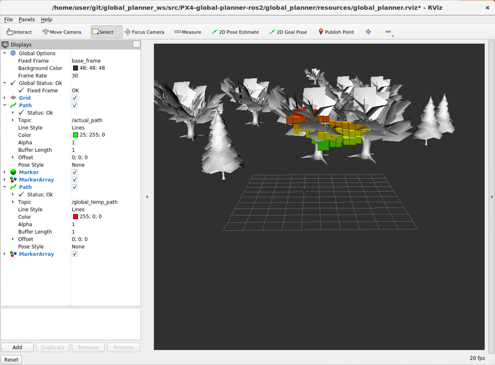

# Obstacle Detection and Avoidance
[](https://github.com/PX4/avoidance/releases)
[](https://github.com/PX4/PX4-Avoidance/actions)
[](https://coveralls.io/github/PX4/avoidance)

> **Warning:** This project is currently not maintained.
> 
> We'd welcome community support to maintain and update the project.
> If you're interested in contributing, please contact the [PX4 development team through normal channels](http://docs.px4.io/main/en/contribute/support.html#forums-and-chat).

PX4 computer vision algorithms packaged as ROS nodes for depth sensor fusion and obstacle avoidance.
This repository contains three different implementations:

  * *local_planner* is a local VFH+* based planner that plans (including some history) in a vector field histogram
  * *global_planner* is a global, graph based planner that plans in a traditional octomap occupancy grid
  * *safe_landing_planner* is a local planner to find safe area to land

The three algorithms are standalone and they are not meant to be used together.

The *local_planner* requires less computational power but it doesn't compute optimal paths towards the goal since it doesn't store information about the already explored environment. An in-depth discussion on how it works can be found in [this thesis](https://drive.google.com/file/d/1EhjTvv1QyUxfdnQnBQcPc-T3Zg3OMnlD/edit). On the other hand, the *global_planner* is computationally more expensive since it builds a map of the environment. For the map to be good enough for navigation, accurate global position and heading are required. An in-depth discussion on how it works can be found in [this thesis](https://drive.google.com/file/d/1hZBBV6zNEpX1OYv_-U6flbC2gmNjqy-L/).
The *safe_landing_planner* classifies the terrain underneath the vehicle based on the mean and standard deviation of the z coordinate of pointcloud points. The pointcloud from a downwards facing sensor is binned into a 2D grid based on the xy point coordinates. For each bin, the mean and standard deviation of z coordinate of the points are calculated and they are used to locate flat areas where it is safe to land.

> **Note** The most developed and used planner is the *local_planner*. This is where you should start.

The documentation contains information about how to setup and run the two planner systems on the Gazebo simulator and on a companion computer running Ubuntu 20.04 (recommended), for both avoidance and collision prevention use cases.

> **Note** PX4-side setup is covered in the PX4 User Guide:
  - [Obstacle Avoidance](https://docs.px4.io/en/computer_vision/obstacle_avoidance.html)
  - [Collision Prevention](https://docs.px4.io/en/computer_vision/collision_prevention.html)

[](https://www.youtube.com/watch?v=VqZkAWSl_U0)

# Table of Contents
- [Getting Started](#getting-started)
  - [Installation](#installation)
    - [Installation for Ubuntu](#installation)
  - [Run the Avoidance Gazebo Simulation](#run-the-avoidance-gazebosimulation)
    - [Local Planner](#local-planner)
    - [Global Planner](#global-planner)
    - [Safe Landing Planner](#safe-landing-planner)
  - [Run on Hardware](#run-on-hardware)
    - [Prerequisite](#prerequisite)
    - [Local Planner](#local-planner)
    - [Global Planner](#global-planner)
- [Troubleshooting](#troubleshooting)
- [Advanced](#advanced)
  - [Message Flows](#message-flow)
    - [PX4 and local planner](#px4-and-local-planner)
    - [PX4 and global planner](#px4-and-global-planner)
- [Contributing](#contributing)

# Getting Started

## Installation

### Installation

This is a step-by-step guide to install and build all the prerequisites for running the avoidance module on **Ubuntu 20.04** with *ROS Noetic* (includes Gazebo 11).
You might want to skip some steps if your system is already partially installed.

> **Note:** These instructions assume your catkin workspace (in which we will build the avoidance module) is in `~/catkin_ws`, and the PX4 Firmware directory is `~/Firmware`.
  Feel free to adapt this to your situation.

1. Add ROS to sources.list:
     ```bash
     sudo sh -c 'echo "deb http://packages.ros.org/ros/ubuntu $(lsb_release -sc) main" > /etc/apt/sources.list.d/ros-latest.list'
     sudo apt install curl
     curl -s https://raw.githubusercontent.com/ros/rosdistro/master/ros.asc | sudo apt-key add -
     sudo apt update
     ```

1. Install ROS with Gazebo:
     ```bash
     sudo apt install ros-noetic-desktop-full

     # Source ROS
     echo "source /opt/ros/noetic/setup.bash" >> ~/.bashrc
     source ~/.bashrc
     ```
   > **Note** We recommend you use the version of Gazebo that comes with your (full) installation of ROS.
   >  If you must to use another Gazebo version, remember to install associated ros-gazebo related packages:
   >  - For Gazebo 8,
       ```
       sudo apt install ros-noetic-gazebo8-*
       ```
    > - For Gazebo 9,
       ```
       sudo apt install ros-noetic-gazebo9-*
       ```

1. Dependencies for building packages
   ```bash
   sudo apt install python3-rosdep python3-rosinstall python3-rosinstall-generator python3-wstool build-essential
   ```

1. Install and initialize rosdep.
   ```bash
   rosdep init
   rosdep update
   ```

1. Install catkin and create your catkin workspace directory.

   ```bash
   sudo apt install python3-catkin-tools
   mkdir -p ~/catkin_ws/src
   ```

1. Install MAVROS (version 0.29.0 or above).
   > **Note:** Instructions to install MAVROS from sources can be found [here](https://dev.px4.io/en/ros/mavros_installation.html).

     ```bash
     sudo apt install ros-noetic-mavros ros-noetic-mavros-extras
     ```

1. Install the *geographiclib* dataset

   ```bash
   wget https://raw.githubusercontent.com/mavlink/mavros/master/mavros/scripts/install_geographiclib_datasets.sh
   chmod +x install_geographiclib_datasets.sh
   sudo ./install_geographiclib_datasets.sh
   ```

1. Install avoidance module dependencies (pointcloud library and octomap).
     ```bash
     sudo apt install libpcl1 ros-noetic-octomap-*
     ```

1. Clone this repository in your catkin workspace in order to build the avoidance node.
   ```bash
   cd ~/catkin_ws/src
   git clone https://github.com/PX4/avoidance.git
   ```

1. Actually build the avoidance node.

   ```bash
   catkin build -w ~/catkin_ws
   ```

   Note that you can build the node in release mode this way:

   ```bash
   catkin build -w ~/catkin_ws --cmake-args -DCMAKE_BUILD_TYPE=Release
   ```

1. Source the catkin setup.bash from your catkin workspace:
   ```bash   
   echo "source ~/catkin_ws/devel/setup.bash" >> ~/.bashrc
   source ~/.bashrc
   ```

## Run the Avoidance Gazebo Simulation

In the following section we guide you through installing and running a Gazebo simulation of both local and global planner.

### Build and Run the Simulator

1. Clone the PX4 Firmware and all its submodules (it may take some time).

   ```bash
   cd ~
   git clone https://github.com/PX4/Firmware.git --recursive
   cd ~/Firmware
   ```

1. Install [PX4 dependencies](http://dev.px4.io/en/setup/dev_env_linux_ubuntu.html#common-dependencies). 
   ```bash
   # Install PX4 "common" dependencies.
   ./Tools/setup/ubuntu.sh --no-sim-tools --no-nuttx
   
   # Gstreamer plugins (for Gazebo camera)
   sudo apt install gstreamer1.0-plugins-bad gstreamer1.0-plugins-base gstreamer1.0-plugins-good gstreamer1.0-plugins-ugly libgstreamer-plugins-base1.0-dev

1. Build the Firmware once in order to generate SDF model files for Gazebo.
   This step will actually run a simulation (that you can immediately close).

   ```bash
   # This is necessary to prevent some Qt-related errors (feel free to try to omit it)
   export QT_X11_NO_MITSHM=1

   # Build and run simulation
   make px4_sitl_default gazebo
   
   # Quit the simulation (Ctrl+C)

   # Setup some more Gazebo-related environment variables (modify this line based on the location of the Firmware folder on your machine)
   . ~/Firmware/Tools/simulation/gazebo-classic/setup_gazebo.bash ~/Firmware ~/Firmware/build/px4_sitl_default
   ```

1. Add the Firmware directory to ROS_PACKAGE_PATH so that ROS can start PX4:
   ```bash
   export ROS_PACKAGE_PATH=${ROS_PACKAGE_PATH}:~/Firmware
   ```
1. Finally, set the GAZEBO_MODEL_PATH in your bashrc:
   ```bash
   echo "export GAZEBO_MODEL_PATH=${GAZEBO_MODEL_PATH}:~/catkin_ws/src/avoidance/avoidance/sim/models:~/catkin_ws/src/avoidance/avoidance/sim/worlds" >> ~/.bashrc
   ```

The last three steps, together with sourcing your catkin **setup.bash** (`source ~/catkin_ws/devel/setup.bash`) should be repeated each time a new terminal window is open.

**OR** you can ensure your ~/.bashrc is setup correctly so that each new terminal is sourced correctly.  

```bash
sudo nano ~/.bashrc
```
Ensure that at the bottom of that document you have exactly this:
```bash
source /opt/ros/noetic/setup.bash
source ~/catkin_ws/devel/setup.bash
. ~/Firmware/Tools/simulation/gazebo-classic/setup_gazebo.bash ~/Firmware ~/Firmware/build/px4_sitl_default
export GAZEBO_MODEL_PATH=${GAZEBO_MODEL_PATH}:~/catkin_ws/src/avoidance/avoidance/sim/models:~/catkin_ws/src/avoidance/avoidance/sim/worlds
export ROS_PACKAGE_PATH=${ROS_PACKAGE_PATH}:~/Firmware
```

You should now be ready to run the simulation using local or global planner.

### Local Planner (default, heavily flight tested)

This section shows how to start the *local_planner* and use it for avoidance in mission or offboard mode.

The planner is based on the [3DVFH+](http://ceur-ws.org/Vol-1319/morse14_paper_08.pdf) algorithm.

> **Note:** You *may* need to install some additional dependencies to run the following code (if not installed):
>   ```sh
>   sudo apt install ros-noetic-stereo-image-proc ros-noetic-image-view
>   ```

Any of the following three launch file scripts can be used to run local planner:
> **Note:** The scripts run the same planner but simulate different sensor/camera setups. They all enable *Obstacle Avoidance* and *Collision Prevention*.
* `local_planner_stereo`: simulates a vehicle with a stereo camera that uses OpenCV's block matching algorithm (SGBM by default) to generate depth information
  ```bash
  roslaunch local_planner local_planner_stereo.launch
  ```
    
  > **Note:** The disparity map from `stereo-image-proc` is published as a [stereo_msgs/DisparityImage](http://docs.ros.org/api/stereo_msgs/html/msg/DisparityImage.html) message, which is not supported by rviz or rqt. 
  > To visualize the message, first open a *new terminal* and setup the required environment variables:
  > ```bash
  > source devel/setup.bash
  > ```
  > Then do either of:
  > - run:
  >   ```bash
  >   rosrun image_view stereo_view stereo:=/stereo image:=image_rect_color
  >   ```
  > - publish the `DisparityImage` as a simple `sensor_msgs/Image`:
  >   ```bash
  >   rosrun topic_tools transform /stereo/disparity /stereo/disparity_image sensor_msgs/Image 'm.image' 
  >   ```
  > The disparity map can then be visualized by *rviz* or *rqt* under the topic */stereo/disparity_image*.

* `local_planner_depth_camera`: simulates vehicle with one forward-facing kinect sensor
  ```bash
  roslaunch local_planner local_planner_depth-camera.launch
  ```

* `local_planner_sitl_3cam`: simulates vehicle with 3 kinect sensors (left, right, front)
  ```bash
  roslaunch local_planner local_planner_sitl_3cam.launch
  ```

You will see the Iris drone unarmed in the Gazebo world.
To start flying, there are two options: OFFBOARD or MISSION mode.
For OFFBOARD, run:

```bash
# In another terminal 
rosrun mavros mavsys mode -c OFFBOARD
rosrun mavros mavsafety arm
```

The drone will first change its altitude to reach the goal height.
It is possible to modify the goal altitude with `rqt_reconfigure` GUI.

Then the drone will start moving towards the goal.
The default x, y goal position can be changed in Rviz by clicking on the 2D Nav Goal button and then choosing the new goal x and y position by clicking on the visualized gray space.
If the goal has been set correctly, a yellow sphere will appear where you have clicked in the grey world.


For MISSIONS, open [QGroundControl](http://qgroundcontrol.com/) and plan a mission as described [here](https://docs.px4.io/en/flight_modes/mission.html). Set the parameter `COM_OBS_AVOID` true.
Start the mission and the vehicle will fly the mission waypoints dynamically recomputing the path such that it is collision free.


### Global Planner (advanced, not flight tested)

This section shows how to start the *global_planner* and use it for avoidance in offboard mode.

```bash
roslaunch global_planner global_planner_stereo.launch
```

You should now see the drone unarmed on the ground in a forest environment as pictured below.



To start flying, put the drone in OFFBOARD mode and arm it. The avoidance node will then take control of it.

```bash
# In another terminal
rosrun mavros mavsys mode -c OFFBOARD
rosrun mavros mavsafety arm
```

Initially the drone should just hover at 3.5m altitude.

From the command line, you can also make Gazebo follow the drone, if you want.

```bash
gz camera --camera-name=gzclient_camera --follow=iris
```

One can plan a new path by setting a new goal with the *2D Nav Goal* button in rviz.
The planned path should show up in rviz and the drone should follow the path, updating it when obstacles are detected.
It is also possible to set a goal without using the obstacle avoidance (i.e. the drone will go straight to this goal and potentially collide with obstacles). To do so, set the position with the *2D Pose Estimate* button in rviz.


### Safe Landing Planner

This section shows how to start the *safe_landing_planner* and use it to land safely in mission or auto land mode. To run the node:

```bash
roslaunch safe_landing_planner safe_landing_planner.launch
```

You will see an unarmed vehicle on the ground. Open [QGroundControl](http://qgroundcontrol.com/), either plan a mission with the last item of type *Land* or fly around the world in Position Control, click the *Land* button on the left side where you wish to land.
At the land position, the vehicle will start to descend towards the ground until it is at `loiter_height` from the ground/obstacle. Then it will start loitering to evaluate the ground underneeth.
If the ground is flat, the vehicle will continue landing. Otherwise it will evaluate the close by terrain in a squared spiral pattern until it finds a good enough ground to land on.

# Run on Hardware

## Prerequisite

### Camera

Both planners require a 3D point cloud of type `sensor_msgs::PointCloud2`. Any camera that can provide such data is compatible.

The officially supported camera is Intel Realsense D435. We recommend using Firmware version 5.9.13.0. The instructions on how to update the Firmware of the camera can be found [here](https://www.intel.com/content/www/us/en/support/articles/000028171/emerging-technologies/intel-realsense-technology.html)

> **Tip:** Be careful when attaching the camera with a USB3 cable. USB3 might might interfere with GPS and other signals. If possible, always use USB2 cables.

Other tested camera models are: Intel Realsense D415 and R200, Occipital Structure Core.

#### Generating Point-clouds from Depth-maps

In case the point-cloud stream already exists, this step can be skipped.

Assuming there already exists a stream of depth-maps on the ROS-topic <depthmap_topic>, we need to generate a corresponding stream of depth-maps.
Start by following the instructions from [PX4/disparity_to_point_cloud](https://github.com/PX4/disparity_to_point_cloud).
Now run the point-cloud generation with the parameters for the camera intrinsics:

```bash
rosrun disparity_to_point_cloud disparity_to_point_cloud_node \
    fx_:=fx fy_:=fy cx_:=cx cy_:=cy base_line_:=base_line disparity:=<depthmap_topic>
```

A stream of point-clouds should now be published to */point_cloud*.

### PX4 Autopilot

Parameters to set through QGC:
* `COM_OBS_AVOID` to Enabled
* `MAV_1_CONFIG`, `MAV_1_MODE`, `SER_TEL2_BAUD` to enable MAVLink on a serial port. For more information: [PX4 Dev Guide](http://dev.px4.io/en/companion_computer/pixhawk_companion.html#pixhawk-setup)

### Companion Computer

* OS: Ubuntu 20.04 OS or a docker container running Ubuntu 20.04 must be setup (e.g. if using on a Yocto based system).
* ROS Noetic: see [Installation](#installation)
* Other Required Components for Intel Realsense:
  - Librealsense (Realsense SDK). The installation instructions can be found [here](https://github.com/IntelRealSense/librealsense/blob/master/doc/installation.md)
  - [Librealsense ROS wrappers](https://github.com/intel-ros/realsense.git)
* Other Required Components for Occipital Structure Core:
  - Download the [Structure SDK](https://structure.io/developers). The version tested with this package is `0.7.1`. Create the `build` directory and build the SDK
  ```bash
  mkdir build
  cd build
  cmake ..
  make
  ```
  - Clone the [ROS wrapper](https://github.com/Auterion/struct_core_ros) in the `catkin_ws`
  - Copy the shared object `Libraries/Structure/Linux/x86_64/libStructure.so` from the SDK into `/usr/local/lib/`
  - Copy the headers from `Libraries/Structure/Headers/` in the SDK to the ROS wrapper include directory `~/catkin_ws/src/struct_core_ros/include`

Tested models:
- local planner: Intel NUC, Jetson TX2, Intel Atom x7-Z8750 (built-in on Intel Aero RTF drone)
- global planner: Odroid

## Global Planner

The global planner has been so far tested on a Odroid companion computer by the development team.

## Local Planner

Once the catkin workspace has been built, to run the planner with a Realsense D435 or Occipital Structure Core camera you can generate the launch file using the script *generate_launchfile.sh*

1. `export CAMERA_CONFIGS="camera_namespace, camera_type, serial_n, tf_x, tf_y, tf_z, tf_yaw, tf_pitch, tf_roll"` where  `camera_type` is either `realsense` or `struct_core_ros`, `tf_*` represents the displacement between the camera and the flight controller. If more than one camera is present, list the different camera configuration separated by a semicolon. Within each camera configuration the parameters are separated by commas.
2. `export DEPTH_CAMERA_FRAME_RATE=frame_rate`. If this variable isn't set, the default frame rate will be taken.
3. `export VEHICLE_CONFIG=/path/to/params.yaml` where the yaml file contains the value of some parameters different from the defaults set in the cfg file. If this variable isn't set, the default parameters values will be used.

Changing the serial number and `DEPTH_CAMERA_FRAME_RATE` don't have any effect on the Structure Core.

For example:
```bash
export CAMERA_CONFIGS="camera_main,realsense,819612070807,0.3,0.32,-0.11,0,0,0"
export DEPTH_CAMERA_FRAME_RATE=30
export VEHICLE_CONFIG=~/catkin_ws/src/avoidance/local_planner/cfg/params_vehicle_1.yaml
./tools/generate_launchfile.sh
roslaunch local_planner avoidance.launch fcu_url:=/dev/ttyACM0:57600
```

where `fcu_url` representing the port connecting the companion computer to the flight controller.
The planner is running correctly if the rate of the processed point cloud is around 10-20 Hz. To check the rate run:

```bash
rostopic hz /local_pointcloud
```

If you would like to read debug statements on the console, please change `custom_rosconsole.conf` to
```bash
log4j.logger.ros.local_planner=DEBUG
```

## Safe Landing Planner

Once the catkin workspace has been built, to run the planner with a Realsense D435 and Occipital Structure Core, you can generate the launch file using the script *generate_launchfile.sh*. The script works the same as described in the section above for the Local Planner. For example:

```bash
export CAMERA_CONFIGS="camera_main,struct_core,819612070807,0.3,0.32,-0.11,0,0,0"
export VEHICLE_CONFIG_SLP=~/catkin_ws/src/avoidance/safe_landing_planner/cfg/slpn_structure_core.yaml
export VEHICLE_CONFIG_WPG=~/catkin_ws/src/avoidance/safe_landing_planner/cfg/wpgn_structure_core.yaml
./safe_landing_planner/tools/generate_launchfile.sh
roslaunch safe_landing_planner safe_landing_planner_launch.launch
```

In the `cfg/` folder there are camera specific configurations for the algorithm nodes. These parameters can be loaded by specifying the file in the `VEHICLE_CONFIG_SLP` and `VEHICLE_CONFIG_WPG` system variable for the safe_landing_planner_node and for the waypoint_generator_node respectively.

The size of the squared shape patch of terrain below the vehicle that is evaluated by the algorithm can be changed to suit different vehicle sizes with the WaypointGeneratorNode parameter `smoothing_land_cell`. The algorithm behavior will also be affected by the height at which the decision to land or not is taken (`loiter_height` parameter in WaypointGeneratorNode) and by the size of neighborhood filter smoothing (`smoothing_size` in LandingSiteDetectionNode).

For different cameras you might also need to tune the thresholds on the number of points in each bin, standard deviation and mean.

# Troubleshooting

### I see the drone position in rviz (shown as a red arrow), but the world around is empty
Check that some camera topics (including */camera/depth/points*) are published with the following command:

```bash
rostopic list | grep camera
```

If */camera/depth/points* is the only one listed, it may be a sign that gazebo is not actually publishing data from the simulated depth camera. Verify this claim by running:

```bash
rostopic echo /camera/depth/points
```

When everything runs correctly, the previous command should show a lot of unreadable data in the terminal. If you don't receive any message, it probably means that gazebo is not publishing the camera data.

Check that the clock is being published by Gazebo:

```bash
rostopic echo /clock
```

If it is not, you have a problem with Gazebo (Did it finish loading the world? Do you see the buildings and the drone in the Gazebo UI?). However, if it is publishing the clock, then it might be a problem with the depth camera plugin. Make sure the package `ros-kinetic-gazebo-ros-pkgs` is installed. If not, install it and rebuild the Firmware (with `$ make px4_sitl_default gazebo` as explained above).

### I see the drone and world in rviz, but the drone does not move when I set a new "2D Nav Goal"
Is the drone in OFFBOARD mode? Is it armed and flying?

```bash
# Set the drone to OFFBOARD mode
rosrun mavros mavsys mode -c OFFBOARD
# Arm
rosrun mavros mavsafety arm
```

### I see the drone and world in rviz, but the drone does not follow the path properly
Some tuning may be required in the file *"<Firmware_dir>/posix-configs/SITL/init/rcS_gazebo_iris"*.

### I see the drone and world in rviz, I am in OFFBOARD mode, but the planner is still not working
Some parameters that can be tuned in *rqt reconfigure*.

# Advanced

## Message Flows

More information about the communication between avoidance system and the Autopilot can be found in the [PX4 User Guide](https://docs.px4.io/en/computer_vision/obstacle_avoidance.html)

### PX4 and local planner

This is the complete message flow *from* PX4 Firmware to the local planner.

PX4 topic | MAVLink | MAVROS Plugin | ROS Msgs. | ROS Topic
--- | --- | --- | --- | ---
vehicle_local_position | LOCAL_POSITION_NED | local_position | geometry_msgs::PoseStamped | mavros/local_position/pose
vehicle_local_position | LOCAL_POSITION_NED | local_position | geometry_msgs::TwistStamped | mavros/local_position/velocity
vehicle_local_position | ALTITUDE | altitude | mavros_msgs::Altitude | mavros/altitude
home_position | ALTITUDE | altitude | mavros_msgs::Altitude | mavros/altitude
vehicle_air_data | ALTITUDE | altitude | mavros_msgs::Altitude | mavros/altitude
vehicle_status | HEARTBEAT | sys_status | mavros_msgs::State | mavros/state
vehicle_trajectory_waypoint_desired | TRAJECTORY_REPRESENTATION_WAYPOINT | trajectory  | mavros_msgs::Trajectory | mavros/trajectory/desired
*none* | MAVLINK_MSG_ID_PARAM_REQUEST_LIST | param | mavros_msgs::Param | /mavros/param/param_value
*none* | MISSION_ITEM | waypoint | mavros_msgs::WaypointList | /mavros/mission/waypoints


This is the complete message flow *to* PX4 Firmware from the local planner.

ROS topic | ROS Msgs. | MAVROS Plugin | MAVLink | PX4 Topic
--- | --- | --- | --- | ---
/mavros/setpoint_position/local (offboard) | geometry_msgs::PoseStamped | setpoint_position | SET_POSITION_LOCAL_POSITION_NED | position_setpoint_triplet
/mavros/trajectory/generated (mission) | mavros_msgs::Trajectory | trajectory | TRAJECTORY_REPRESENTATION_WAYPOINT | vehicle_trajectory_waypoint
/mavros/obstacle/send | sensor_msgs::LaserScan | obstacle_distance | OBSTACLE_DISTANCE | obstacle_distance
/mavros/companion_process/status | mavros_msgs::CompanionProcessStatus | companion_process_status | HEARTBEAT | telemetry_status


### PX4 and global planner

This is the complete message flow *from* PX4 Firmware *to* the global planner.

PX4 topic | MAVLink | MAVROS Plugin | ROS Msgs. | Topic
--- | --- | --- | --- | ---
vehicle_local_position | LOCAL_POSITION_NED | local_position | geometry_msgs::PoseStamped | mavros/local_position/pose
vehicle_local_position | LOCAL_POSITION_NED | local_position | geometry_msgs::TwistStamped | mavros/local_position/velocity
vehicle_trajectory_waypoint_desired | TRAJECTORY_REPRESENTATION_WAYPOINT | trajectory  | mavros_msgs::Trajectory | mavros/trajectory/desired

This is the complete message flow *to* PX4 Firmware *from* the global planner.

ROS topic | ROS Msgs. | MAVROS Plugin | MAVLink | PX4 Topic
--- | --- | --- | --- | ---
/mavros/setpoint_position/local (offboard) | geometry_msgs::PoseStamped | setpoint_position | SET_POSITION_LOCAL_POSITION_NED | position_setpoint_triplet
/mavros/trajectory/generated (mission) | mavros_msgs::Trajectory | trajectory | TRAJECTORY_REPRESENTATION_WAYPOINT | vehicle_trajectory_waypoint

### PX4 and safe landing planner

This is the complete message flow *from* PX4 Firmware to the safe landing planner.

PX4 topic | MAVLink | MAVROS Plugin | ROS Msgs. | ROS Topic
--- | --- | --- | --- | ---
vehicle_local_position | LOCAL_POSITION_NED | local_position | geometry_msgs::PoseStamped | mavros/local_position/pose
vehicle_status | HEARTBEAT | sys_status | mavros_msgs::State | mavros/state
vehicle_trajectory_waypoint_desired | TRAJECTORY_REPRESENTATION_WAYPOINT | trajectory  | mavros_msgs::Trajectory | mavros/trajectory/desired
*none* | MAVLINK_MSG_ID_PARAM_REQUEST_LIST | param | mavros_msgs::Param | /mavros/param/param_value

This is the complete message flow *to* PX4 Firmware from the safe landing planner.

ROS topic | ROS Msgs. | MAVROS Plugin | MAVLink | PX4 Topic
--- | --- | --- | --- | ---
/mavros/trajectory/generated (mission) | mavros_msgs::Trajectory | trajectory | TRAJECTORY_REPRESENTATION_WAYPOINT | vehicle_trajectory_waypoint
/mavros/companion_process/status | mavros_msgs::CompanionProcessStatus | companion_process_status | HEARTBEAT | telemetry_status

# Contributing

Fork the project and then clone your repository. Create a new branch off of master for your new feature or bug fix.

Please, take into consideration our [coding style](https://github.com/PX4/avoidance/blob/master/tools/fix_style.sh).
For convenience, you can install the commit hooks which will run this formatting on every commit. To do so, run
`./tools/set_up_commit_hooks` from the main directory.

Commit your changes with informative commit messages, push your branch and open a new pull request. Please provide ROS bags and the Autopilot flight logs relevant to the changes you have made.
